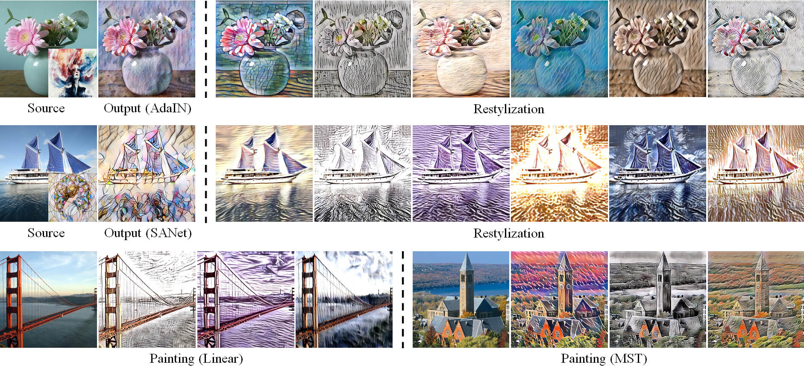
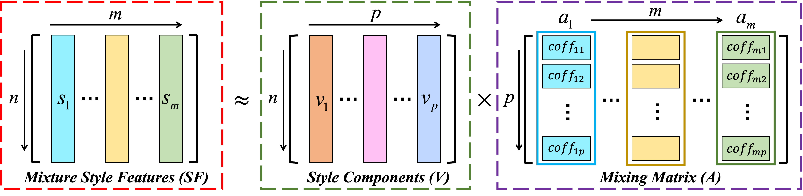

# ArtIns - Artistic Style Discovery with Independent Components


**Figure 1:** *Diverse restylized artworks from different backbones including AdaIN, Linear, SANet and MST. In the first two rows, the first column is the source of the content image with the style image and the second column is the original artistic output, the other columns are the output images with artistic styles discovered by our algorithm. In the last row, given a natural scene, our method yields the other paintings.*

> **Artistic Style Discovery with Independent Components** <br>
> Xin Xie, Yi Li, Huaibo Huang, Haiyan Fu, Wanwan Wang, Yanqing Guo <br>
> *Computer Vision and Pattern Recognition (CVPR), 2022 (**Poster**)*
### [Paper](https://openaccess.thecvf.com/content/CVPR2022/papers/Xie_Artistic_Style_Discovery_With_Independent_Components_CVPR_2022_paper.pdf) | [Demo](https://www.youtube.com/watch?v=7-vFEQEWHYs) | [Poster](https://github.com/Shelsin/FIleStore/blob/main/ArtIns_CVPR2022/ArtIns_poster.pdf)

In this repository, we propose an unsupervised approach, termed as **ArtIns**, to discover diverse styles from the latent space consisting of diverse style features. Specifically, we rethink the sense of the style features and find that the latent style representations may be composed of multiple independent style components. These style components can be captured from the latent style space by mathematical operations. Finally, new styles are synthesized by linearly combining style ingredients with different coefficients.


**Figure 2:** *Some components can be given explicit property definitions, such as exposure, brightness, definition, contrast, saturation, color temperature, etc.*

## Artistic Ingredients Separation
Collecting different style features to build the mixed matrix, which is divided into multiple independent artistic components by FastICA algorithm like the cocktail party problem. 


**Figure 3:** *The style features are linear sum of style components where the mixed matrix SF can be divided into the mixing matrix A and style components V.*

**NOTE:** The number of the style examples is more than that of the components, which is necessary to ensure that artistic ingredients are independent. The pre-trained models (AdaIN and SANet) can be download [here](https://drive.google.com/drive/folders/1A81l0uQ4xFvfGNtdXFF8jXYCvNzca4uE).

```bash
python component.py --model_name ${MODEL_NAME} --num_components ${NUM_COMPONENTS}
```

## Artwork Adjustment
Different components control different style effect, and artwork can be adjusted by changing the style code according to the style components.
```bash
python main.py --model_name ${MODEL_NAME} --num_semantics ${NUM_SEMANTICS}
```


## Citation
If you find our work useful in your research, please cite our paper using the following BibTeX entry ~ 

```bibtex
@inproceedings{shelsin2022artins,
  title     = {Artistic Style Discovery with Independent Components},
  author    = {Xin Xie and Yi Li and Huaibo Huang and Haiyan Fu and Wanwan Wang and Yanqing Guo},
  booktitle = {IEEE Conference on Computer Vision and Pattern Recognition (CVPR)},
  year      = {2022}
}
```
