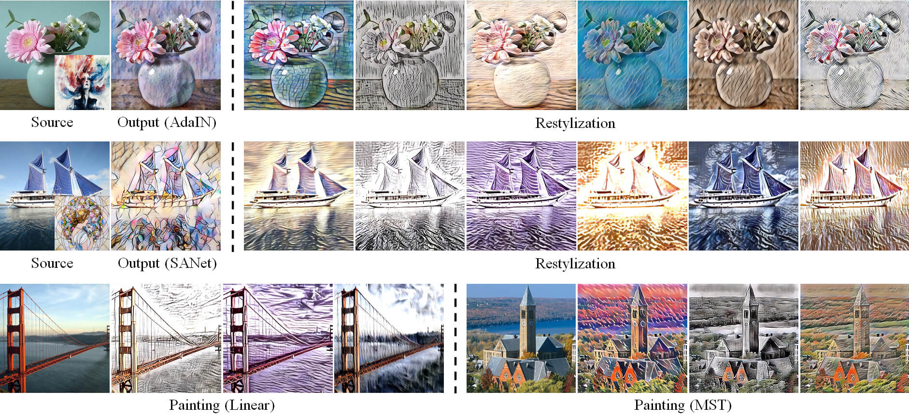

# ArtIns - Artistic Style Discovery with Independent Components

**Figure:** *Diverse restylized artworks from different backbones including AdaIN, Linear, SANet and MST. In the first two rows, the first column is the source of the content image with the style image and the second column is the original artistic output, the other columns are the output images with artistic styles discovered by our algorithm. In the last row, given a natural scene, our method yields the other paintings.*

> **Artistic Style Discovery with Independent Components**  
> Xin Xie, Yi Li, Huaibo Huang, Haiyan Fu, Wanwan Wang, Yanqing Guo  
> *Computer Vision and Pattern Recognition (CVPR), 2022 (**Poster**)*
### [Paper](https://github.com/Shelsin/ArtIns) | [Poster](https://github.com/Shelsin/FIleStore/blob/main/ArtIns_CVPR2022/ArtIns_poster.pdf)

In this repository, we propose an unsupervised approach, termed as **ArtIns**, to discover diverse styles from the latent space consisting of diverse style features. Specifically, we rethink the sense of the style features and find that the latent style representations may be composed of multiple independent style components. These style components can be captured from the latent style space by mathematical operations. Finally, new styles are synthesized by linearly combining style ingredients with different coefficients.

**Figure:** *These components can be given explicit property definitions, such as exposure, brightness, defini- tion, contrast, saturation, color temperature, etc.*

releasing
